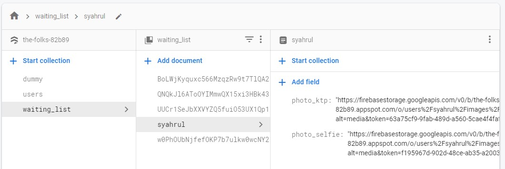

# Face Similarity  
A Bangkit Capstone Project for detecting similarity of two or more faces while performing semi-auto person verification.   
  
  
### Penjelasan Program  
1. main.py
Merupakan program utama yang menggunakan flask untuk dijalankan di cloud menggunakan virtual machine atau bisa juga di local host komputer pribadi.  
Program ini akan menjalankan program Face Similarity dan menghasilkan nilai prediksi jika memanggil link berikut -> http://localhost:8080/verify?user_id=syahrul
2. FaceDetection.py
Merupakan program untuk mengekstrak wajah pada foto selfi dan ktp dan menghasilkan sebuah array images yang akan dimasukan ke model Face Similarity
3. model/model.py
Merupakan model neural net untuk mendeteksi kemiripan antara dua wajah.  
  
### Cara Menjalakan di Local  Host
1. Install semua library dengan menjalankan

    `pip3 install -r requirements.py --user` 
2. Jalankan program utama

    `python3 main.py`

3. Buka halaman utama webserver di browser

    `http://127.0.0.1:8080/`

4. Apabila halaman bisa di akses, maka sudah bisa digunakan untuk mendeteksi kemiripan wajah

    `http://127.0.0.1:8080/verify?user_id=syahrul`

### Cara Menjalankan di Virtual Machine
1. Install semua library dengan menjalankan

    `pip3 install -r requirements.py --user `

2. Install Gunicorn

    `pip3 install gunicorn --use`r

3. Jalankan program utama

    `python3 main.py`

4. Buka halaman utama webserver di browser

    `http://EXTERNAL_IP_ADDRESS:8080/`

5. Apabila halaman bisa di akses, maka sudah bisa digunakan untuk mendeteksi kemiripan wajah

    `http://EXTERNAL_IP_ADDRESS:8080/verify?user_id=syahrul`

### Output Program
Jika program berhasil dijalankan, maka akan menghasilkan keluaran berikut:

`{"user_id": "syahrul", "is_success": true, "verification_score": "0.6815729", "message": "Predicting similarity success!"}`

### Modifikasi Server
Program ini terintegrasi dengan server Firebase sehingga terdapat beberapa configurasi yang harus disesuaikan, diantaranya adalah:
1. serviceAccount.json
Merupakan sebuah kredensial agar program python dapat mengambil data dan mendownload gambar dari firebase. Dapat diperoleh dari konfigurasi pada Halaman Firebase.
2. FCM_KEY pada main.py
Merupakan sebuah kunci API pada FCM yang digunakan untuk mengirim notifikasi ke aplikasi android yang telah di integrasikan. Diperoleh dari halaman Firebase.
3. Link Foto KTP dan Selfi
Modifikasi konten pada Firebase Firestore seperti pada gambar dibawah ini

